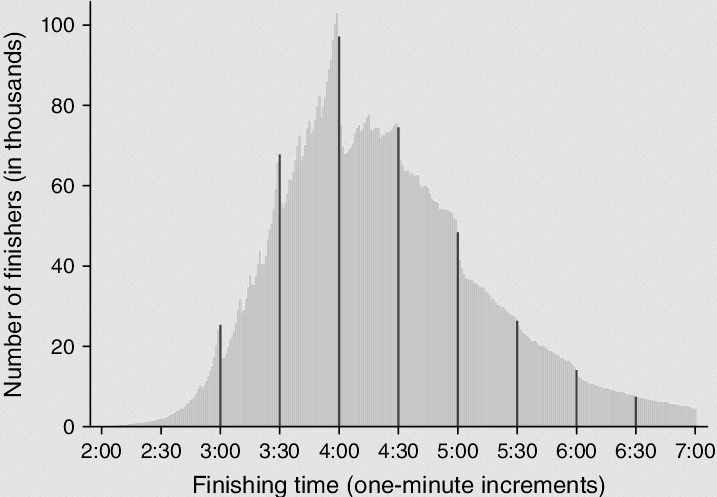
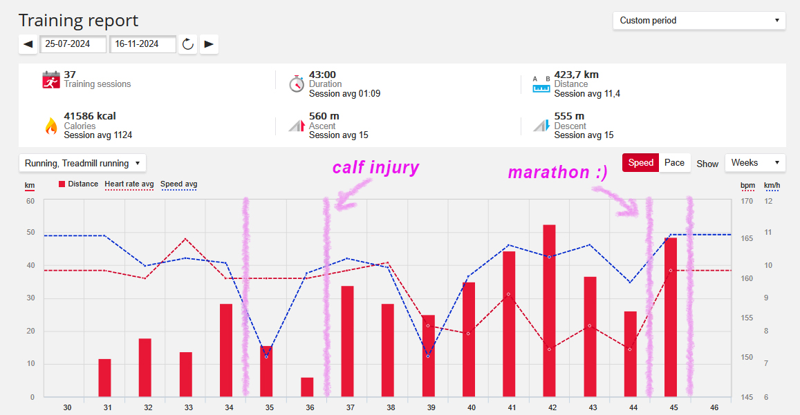
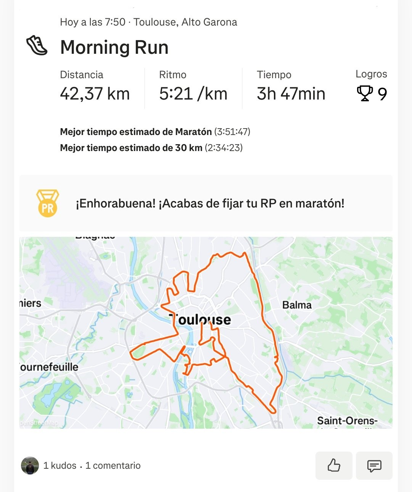
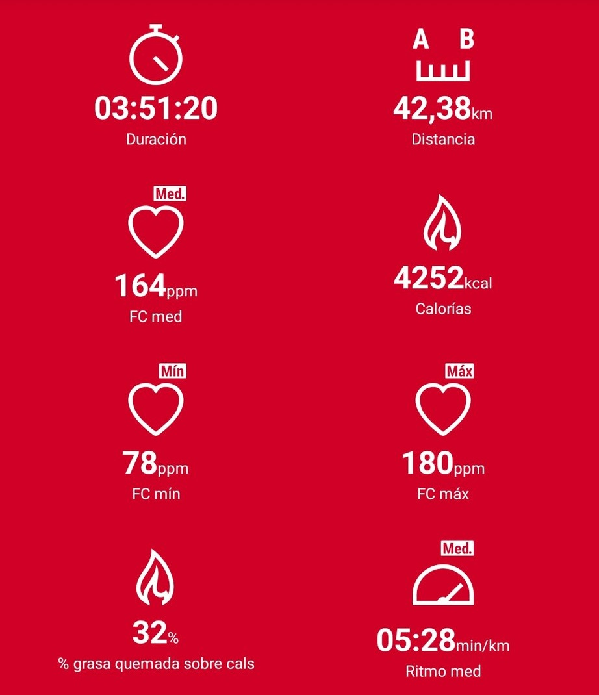
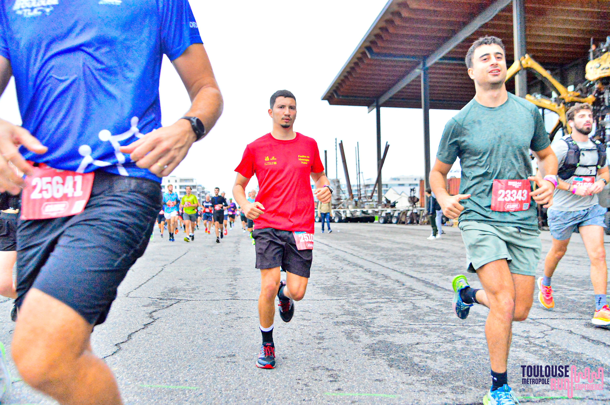
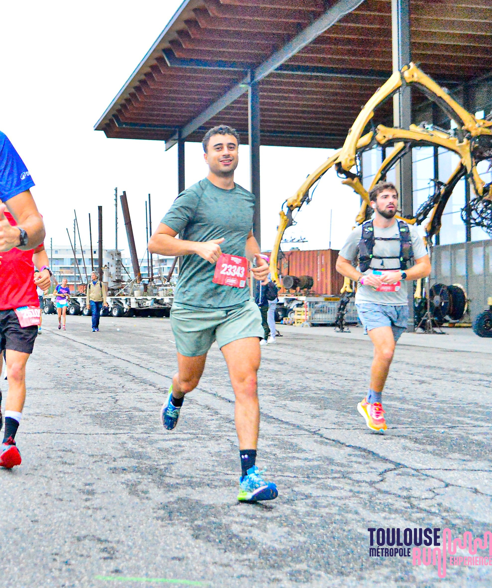
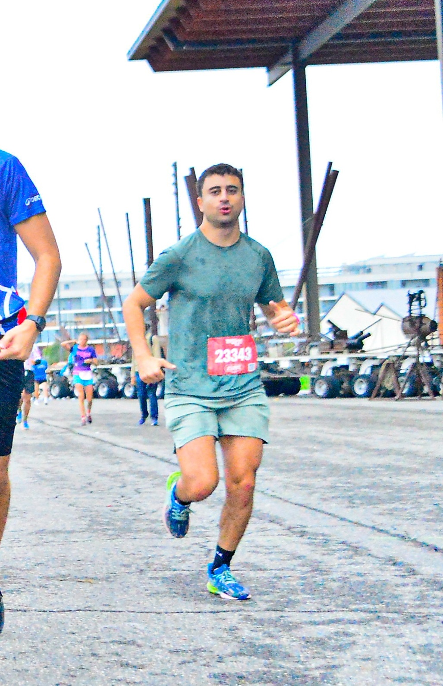
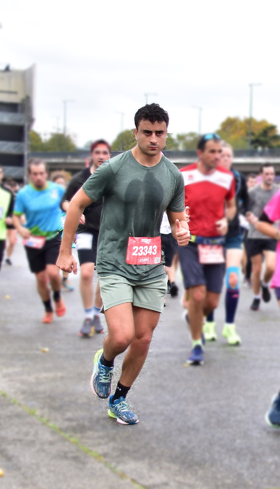
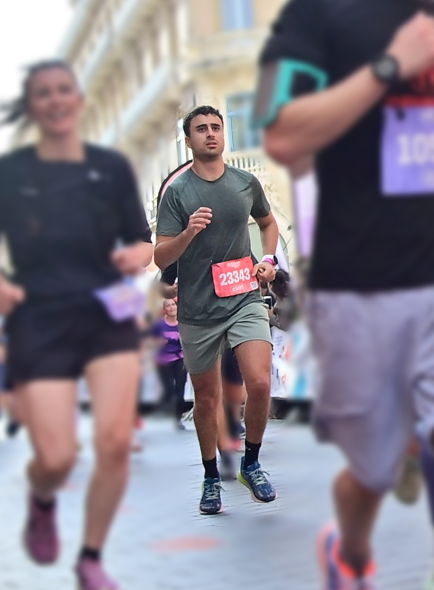
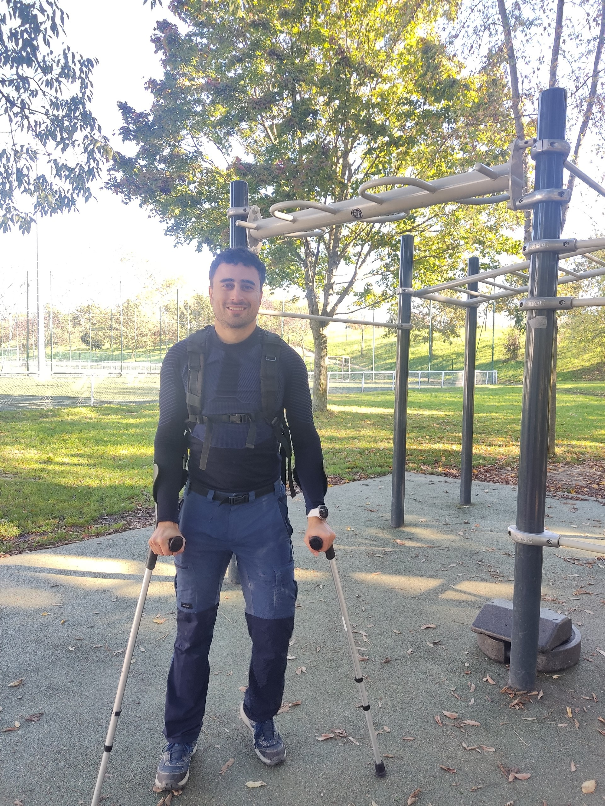

# My First Marathon: Toulouse 2024

The adventure of my **first marathon** started long before the actual race. From sweating through summer training to some calf pain and recovery rides on the bike, every step added up to that day. Here’s the story of my **42.195 kilometers around Toulouse** and the experience of pushing my limits until my body had nothing left to give.

## Training - The Long Road to 42K

It all started in **July 2024**, when I began training for my first ever marathon. Most of my runs were **outdoors**, exploring the city and nearby trails, gradually building up my endurance and pace. I trained mainly with a colleague, who not only shared the long runs but also motivated me to stay consistent — honestly, without him, I probably wouldn’t even have signed up for the marathon in the first place.

My goal was to complete it in less than 4 hours as I saw this interesting and funny graph of marathon finishing times.

Midway through the plan, around **week 5**, I had to hit pause due to **calf discomfort**. It wasn’t catastrophic, but enough to put running on hold for a bit. To stay active and recover, I switched to **cycling**, which helped maintain my cardio base without stressing the injury. 

Slowly, I recovered and ramped up the training again, culminating in a strong block just before race day.

---

## Race Day

**November 10, 2024** - Race day! The route offered a beautiful urban tour, crossing spots like **Cité de l’espace**, **Île du Ramier**,  **Piste des Géants**, and many iconic streets in between. The **crowd support was incredible**, and made a real difference, especially when things got ugly after **km 30**.

    
    

    
    

---

## The Merging Mess

Up until **km 30**, I was feeling tired but managing well — legs heavy, but the rhythm was still there. Then came **the chaos**: at **km 26**, the marathon route merged with the **half-marathon** runners. Suddenly, I was surrounded by runners going **slower**, creating constant bottlenecks.

The next 16 kilometers were a constant zig-zag, dodging and weaving, constantly breaking my rhythm. This **stop-and-go effort completely killed my flow**, making every restart harder than the last.

By **km 33**, the first cramps kicked in hard. My hamstrings were the first to seize up. By **km 37**, both hamstrings were cramping regularly. Every step was a gamble — would the leg hold, or would it lock up again?

---

## Final Kilometers - Pure Survival Mode

The last 5 kilometers were a brutal combination of **mental battle and physical survival**. The cramps were constant, the pace slowed and each time I tried to accelerate to pass slower runners there was a chance to get a cramp. The biggest cramps I had were by trying to pass slower runners by jumping onto the sidewalks.

Crossing the finish line after **3h51** was a mix of **pride, relief, and little bit of frustration**, but ultimately, the joy of completing my first marathon won out. And in less than 4h00 !

    
    

---

## Muletas and Recovery

The cramps were just the start. By the next morning, walking was almost impossible. A quick medical check confirmed **tendinopathy** in the right hamstring insertion.

---

## Honest Review - Toulouse Marathon Organization

Running my first marathon was an unforgettable personal milestone — but I can’t ignore the **organizational issues**:

- **Merging the half-marathon with the marathon around km 26 created a lot of unnecessary difficulties.** The way it was handled led to constant dodging, broken rhythm, and added fatigue, especially in the final stretch.
- **Post-race exit was chaotic and overcrowded**, with **long waits to leave Place du Capitole** — not ideal when you’re cramping and just want to sit down.
- **For a €70 entry fee, the overall organization and services felt expensive for what was provided.**

---

## Final Thoughts

Despite the pain, the cramps, and the chaotic organization, **running my first marathon is something I’ll always be proud of**. There’s something special about pushing yourself into unknown territory, digging deeper than you thought possible, and finding your way to the finish line.

This was just the first. There will be more to come :)

---